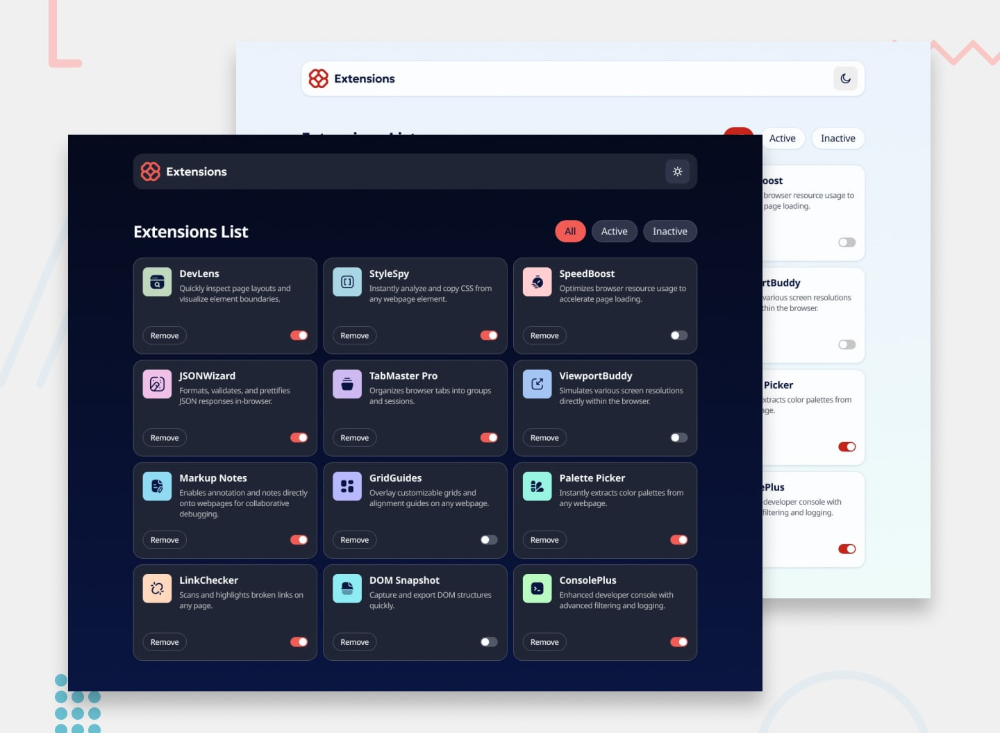

# Frontend Mentor - Browser extensions manager UI solution

This is a solution to the [Browser extensions manager UI challenge on Frontend Mentor](https://www.frontendmentor.io/challenges/browser-extension-manager-ui-yNZnOfsMAp). Frontend Mentor challenges help you improve your coding skills by building realistic projects.

## Table of contents

- [Overview](#overview)
  - [The challenge](#the-challenge)
  - [Screenshot](#screenshot)
  - [Links](#links)
- [My process](#my-process)
  - [Built with](#built-with)
  - [What I learned](#what-i-learned)
  - [Continued development](#continued-development)
- [Author](#author)

## Overview

### The challenge

Users should be able to:

- Toggle extensions between active and inactive states
- Filter active and inactive extensions
- Remove extensions from the list
- Select their color theme
- View the optimal layout for the interface depending on their device's screen size
- See hover and focus states for all interactive elements on the page

### Screenshot



### Links

- Solution URL: [frontendmentor.io](https://www.frontendmentor.io/solutions/browser-extension-manager-built-with-angular-and-tailwindcss-EdLro9N3Sj)
- Live Site URL: [bextm.netlify.app](https://bextm.netlify.app/)

## My process

### Built with

- Semantic HTML5 markup
- Flexbox
- CSS Grid
- Mobile-first workflow
- [GSAP](https://gsap.com/) - Animation library
- [NgRx Signals](https://ngrx.io/guide/signals/) - State Management library
- [TailwindCSS v4](https://tailwindcss.com/) - TailwindCSS
- [Angular](https://angular.dev/) - Frontend framework

### What I learned

#### 1. Accessible filter buttons

To make a group of filter buttons accessible, ensure they are semantically grouped using `role="group"` or `role="toolbar"`, and labeled using `aria-label` or `aria-labelledby`, and that the selected button's state is indicated using `aria-pressed`.

Here's a more detailed breakdown:

**Semantic Grouping:**

- Use `role="group"` for a simple button group or `role="toolbar"` for a more complex toolbar with multiple groups.

**Labeling:**

- Use `aria-label="Filter Options"` or `aria-labelledby="filter-label"` to provide a descriptive label for the entire group.
- If you have a separate label element, use `aria-labelledby="filter-label"` to link the label to the button group.

**Selected State:**

- Use `aria-pressed="true"` on the currently selected button to indicate its state to screen reader users.
- When a button is toggled, ensure the `aria-pressed` attribute updates accordingly.

**Keyboard Navigation:**

- Ensure the filter group is a single tab stop, allowing users to navigate to it with the tab key.
- Use arrow keys to navigate within the filter group.

**Visual Cues:**

- Provide distinct visual cues for different button states (hover, focus, active).
- Ensure sufficient color contrast between the button text and background.

**Example:**

```html
<div role="group" aria-label="Filter Options">
  <button aria-pressed="false">All</button>
  <button aria-pressed="true">Active</button>
  <button aria-pressed="false">Inactive</button>
</div>
```

> Other things learnt would be published subsequently in my blog posts.

### Continued development

- Add some tests and documentation with storybook

## Author

- Frontend Mentor - [@iediong](https://www.frontendmentor.io/profile/iediong)
- Twitter - [@iediong](https://www.twitter.com/iediong)
